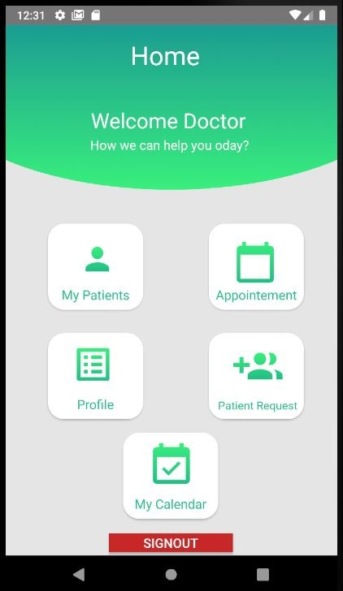
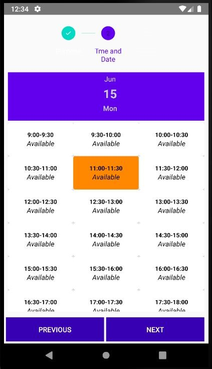
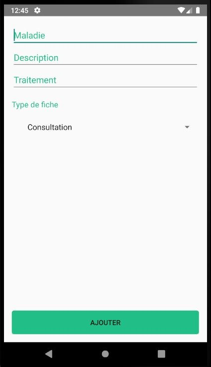

## EWellness App
A mobile application that facilitates making appointments and monitoring patients.

## 🤓 Authors
**Lebogang Bassie**
**Dumisane Nkosi**
**Simphiwe Ngema**

## Screenshots

||

  Find Appointment                 |    Select Appointment        | Accept Appointment
:-------------------------:|:-------------------------:|:----------------------
|)|

  Add Treatment                |    Medical Folder        | Contact
:-------------------------:|:-------------------------:|:----------------------
||

